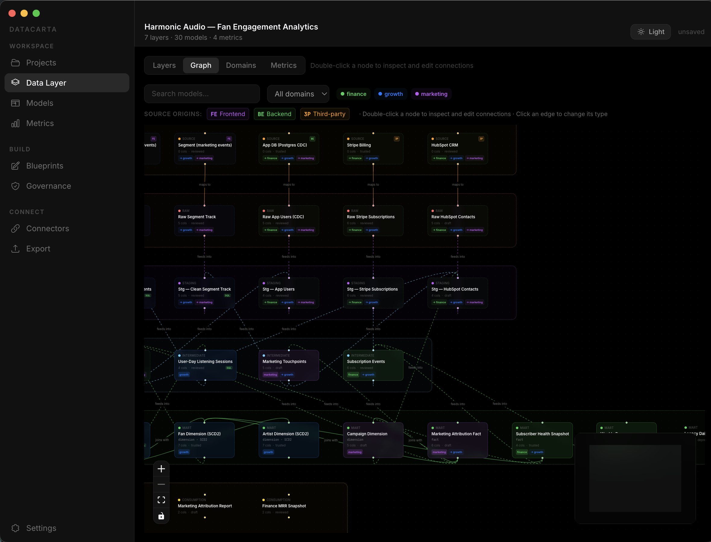
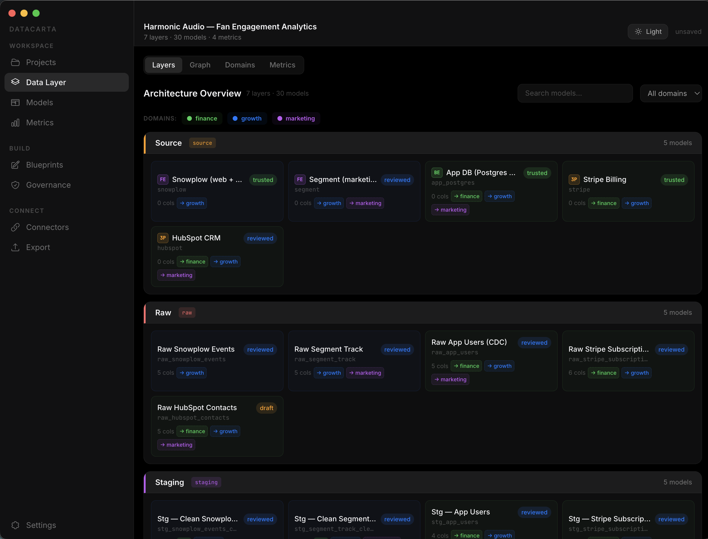
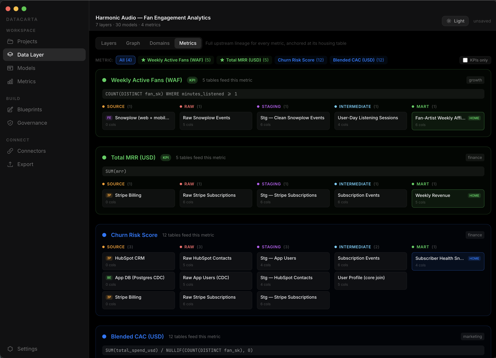
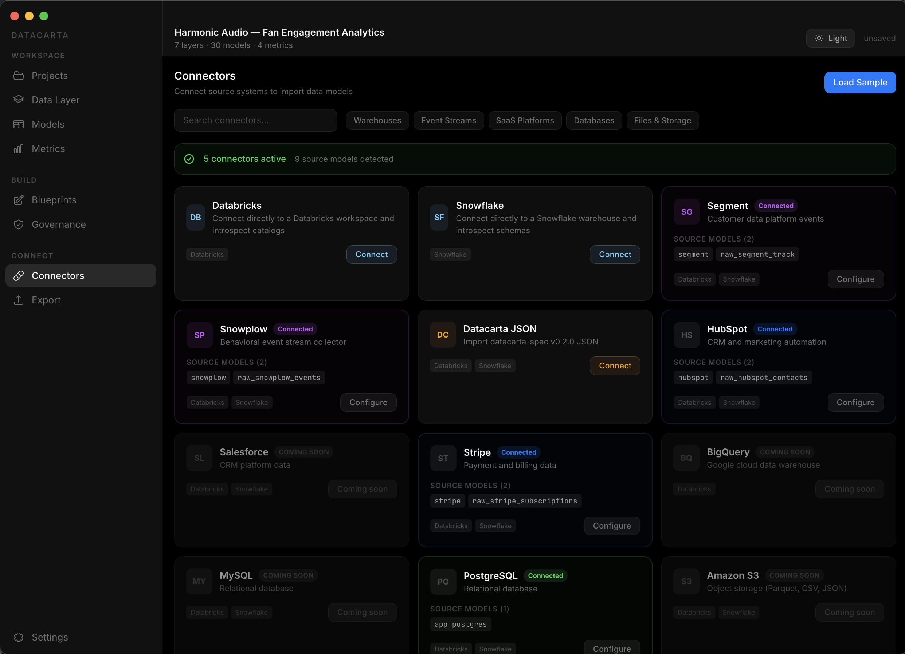

# Datacarta

**An open spec and desktop studio for mapping your data architecture.**

Datacarta gives you a single, shared picture of how data flows through your company — from raw source systems, through staging and modeling, all the way to the dashboards and KPIs the business actually looks at. Open the desktop studio, point it at your warehouse, and see your architecture as a graph you can navigate, annotate, and package up for humans or AI.



## Why Datacarta

Most data teams describe their stack in a mix of Notion pages, dbt DAGs, warehouse metadata, and tribal knowledge. Datacarta gives you one portable artifact — a **context graph** — that captures all of it:

- **Layers** — source, raw, staging, intermediate, mart, and beyond.
- **Models** — every table, view, and file, with columns, types, trust level, and SQL.
- **Domains** — which business areas each model serves.
- **Metrics & KPIs** — the measurements that matter, and the full upstream lineage behind each one.
- **Blueprints** — drafts of models you haven't built yet, tracked alongside the real ones.
- **Governance** — validation rules and violations, right next to the graph they check.

It's just JSON. The [schema lives in this repo](spec/schema/datacarta-graph.schema.json). Anything can emit it; anything can consume it.

## What's in this repo

This is a monorepo containing the four public packages:

| Package | Description |
|---|---|
| [`spec/`](spec) | Canonical schema, TypeScript types, validation, and samples. The source of truth for what a Datacarta graph looks like. |
| [`connectors/`](connectors) | Open-source connector SDK and starter connectors (file, mock, plus vendor stubs). |
| [`app/`](app) | Datacarta Studio — the Electron desktop app you see in the screenshots. |
| [`mcp/`](mcp) | Model Context Protocol server that exposes a local graph to AI assistants over stdio. |

## Quick start

Prerequisites: **Node.js 20+** and **npm 10+**.

```sh
git clone https://github.com/Datacarta/datacarta.git
cd datacarta
npm install
npm run dev
```

That opens the desktop studio. It starts on the Projects screen — from there you can **create an empty project and bring in your own tables** via Connectors, or **load the bundled Harmonic Audio example** to explore a fully populated graph end-to-end.

### Other commands

```sh
npm run build:spec        # build the spec package (needed before running the app fresh)
npm run build             # build spec, connectors, and mcp
npm test                  # run the spec's validation test suite
npm --workspace app run package   # build a local Electron .app bundle
npm --workspace app run dist      # build signable installers for macOS / Windows / Linux
```

## The studio at a glance

**Layered architecture overview.** Every table, grouped by the layer it lives in, with trust indicators and domain tags.



**Full upstream lineage behind every metric.** Pick a KPI, see every table that feeds it, grouped by layer.



**Connectors for real warehouses.** Bring in live metadata from Snowflake, Databricks, BigQuery, and more via personal access tokens. Tokens never leave your machine.



## Importing from a warehouse

The desktop app introspects warehouse metadata directly using a personal access token (PAT). Nothing is sent to a Datacarta server — requests go straight from the Electron main process to your warehouse.

- **Snowflake** — queries `INFORMATION_SCHEMA.COLUMNS` via the SQL API using a programmatic access token.
- **Databricks** — reads Unity Catalog tables via the workspace REST API.
- **File import** — drop in a `datacarta-graph.json` you exported or generated elsewhere.

See the [connectors README](connectors/README.md) for the adapter interface if you want to write a new one.

## Using the spec on its own

You don't need the desktop app to use the spec. Any tool can emit a graph that validates against [`spec/schema/datacarta-graph.schema.json`](spec/schema/datacarta-graph.schema.json) and any other tool can consume it.

```ts
import {
  validateDatacartaGraph,
  type DatacartaGraph,
} from "datacarta-spec/client";

const graph: unknown = JSON.parse(text);
const result = validateDatacartaGraph(graph);
if (!result.ok) {
  console.error(result.errors);
  process.exit(1);
}
// graph is now a valid DatacartaGraph
```

## MCP server for AI assistants

The `mcp/` package exposes a Datacarta graph to any MCP-compatible assistant (Claude Desktop, Cursor, etc.) over stdio. You point it at a local graph JSON and get tools like `list_models`, `search_nodes`, `neighbors`, and `export_context_package` for free. See [`mcp/README.md`](mcp/README.md).

## Contributing

Datacarta is MIT-licensed and we want your help making it the default way to describe a data architecture. Good first contributions:

- New connectors (dbt, Fivetran, Airbyte, BigQuery, Redshift, Postgres…)
- Governance rule templates
- Sample graphs from real-ish domains — we shipped a music-streaming example; show us yours
- UI polish, accessibility, and keyboard shortcuts in the studio

Open an issue before large work so we can align on scope. PRs welcome.

## License

[MIT](LICENSE)
